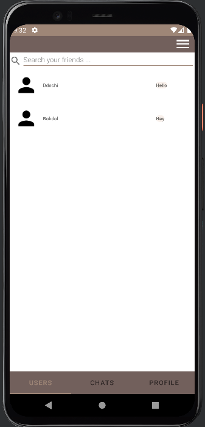
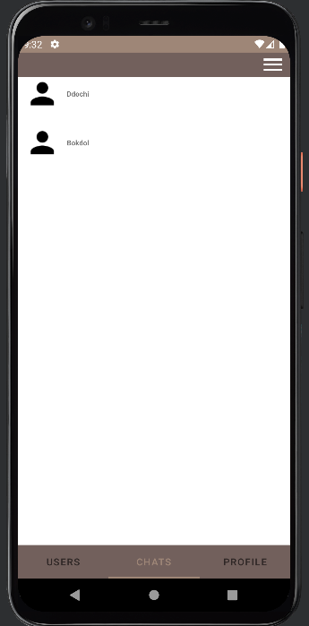
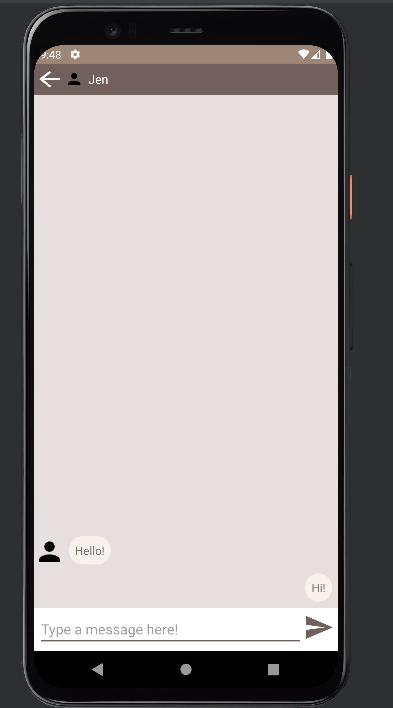
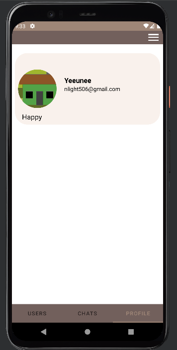
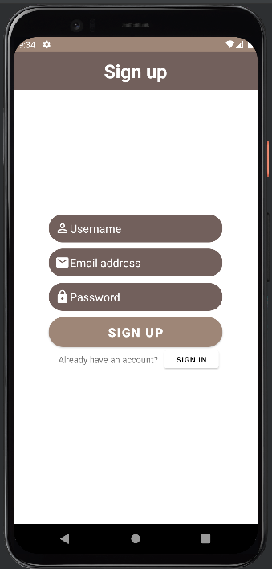

# chatApp

#  Table of Contents
1. [General Info](#general-info)
2. [Requirements](#requirements)
3. [Screenshots](#screenshots)
4. [Technologies](#technologies)
5. [Installation](#installation)
6. [Features](#features) 
7. [How to use?](#how-to-use)

# General Information

ChatApp is an android mobile application that allows to send and receive real-time messages between users.

# Requirements

Android 11.0(R) API level 30 is required to run this application.

# Screenshots

In USER fragment, users can see other users. \

In CHAT fragment, there are list of the chat rooms. \

Users can send and receive messages between them.  

Users can update their profile in the profile fragment. \

# Technologies
* Java
* Android Studio
* Android 11.0+(R) API level 30

# Installation

$ git clone https://github.com/yeeunPark0630/chatapp

1. Open Android Studio, and open workspace of RecognizeGesture.
2. Install Android 11.0(R) API level 30, and add virtual device with it.
3. Build this application, and run.

# Features

ChatApp has notable features including login, signup/sign-out, reset password, change profile image/password/username/status message, and search friends in the users fragment.

# How to use?

## Sign up

User could sign up chat app by using email address and password. \

## Log in
User can log in to the app by enter their email address and password. The app also supports resetting password for the users who forgot their password, for reset password, user can simply click the "Reset password" button.  

## Users Fragment
In the USERS fragment, it not only show a user list on the screen, but it also supportS searching the other users by user name at the top of the screen.\
Moreover, if users click the other users, it leads to the chat room with the other users who is clicked.  

At the status bar, there is a menu button that provides change password/username and sign out. \
After users click the menu button, the three other button will show up, then users can press their desired button. \

## CHATS Fragment
ChatApp shows the list of chat room in the CHATS fragment.
If users click the other users, it leads to the chat room with the other users who is clicked.  

## PROFILE Fragment

Users can update their profile which includes user name, profile image, and status name.  
Press profile image and user name leads to other screen which supports change it, and user can simply update status message by modifying it at the same screen.
